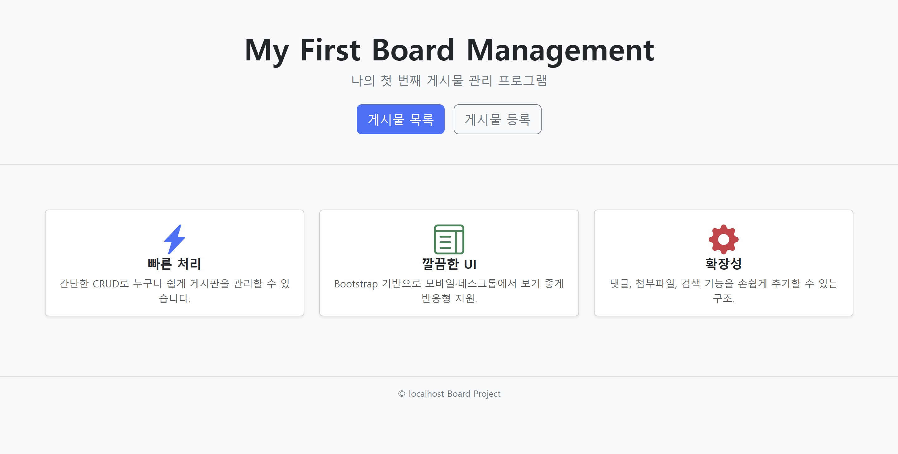
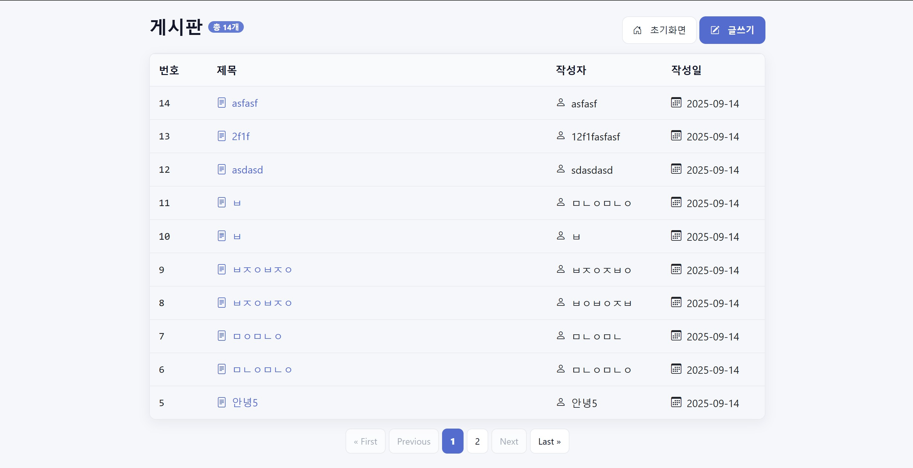
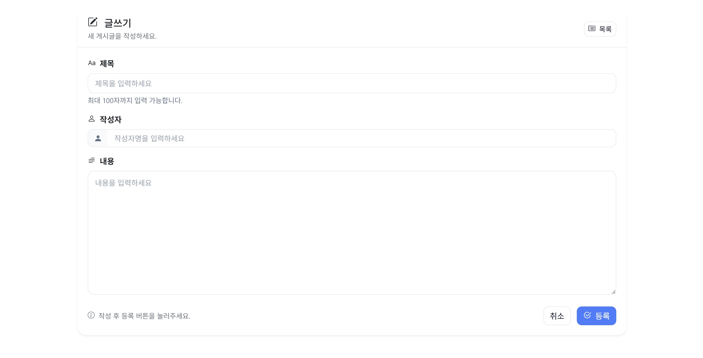
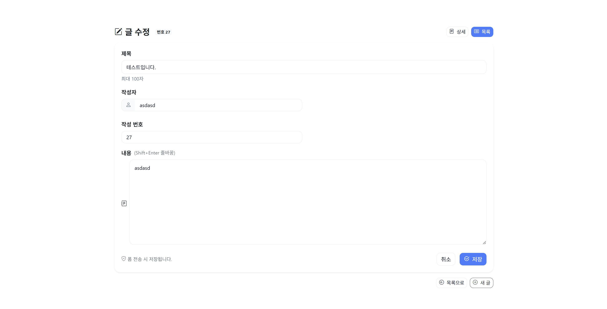
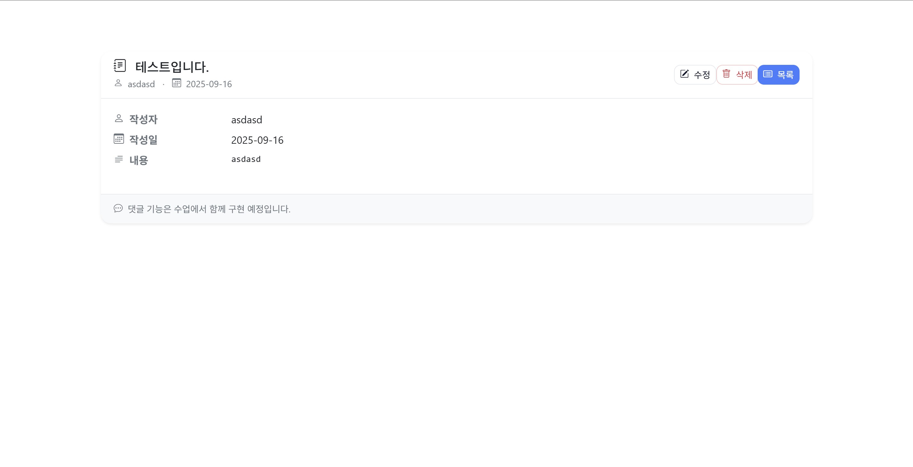

# Board MVC (JSP + Servlet + JDBC)

JSP/Servlet 기반의 간단한 게시판(목록/상세/등록/수정/삭제 + 페이징) 학습/과제용 프로젝트입니다. Tomcat의 **JNDI DataSource**로 MySQL에 연결합니다.

[📥 프로젝트 전체 다운로드는 여기를 클릭해주세요](./board-mvc.zip?raw=true)

---

## 📸 Screenshots

* **처음 화면**

  

* **목록(List)**

  

* **글 등록(Create)**

  

* **글 수정(Update)**

  

* **상세보기(Detail)**

  

> 파일명 예시: `01_home.png, 02_list.png, 03_create.png, 04_edit.png, 05_detail.png`

---

## ✨ 주요 기능

* 게시글 **목록** (페이징)
* 게시글 **등록/수정/삭제** (POST 처리)
* 게시글 **상세보기**
* **JSTL** & **EL**을 이용한 뷰 렌더링
* **JNDI DataSource**를 활용한 커넥션 풀링

---

## 🧰 기술 스택

* **Java 8+**, **JSP/Servlet/JSTL**
* **Tomcat 9\~10** (테스트 기준)
* **MySQL 8.x** (또는 MariaDB 호환)
* **JDBC (Connector/J)**
* CSS: 프로젝트의 `/css/board.css` (필요 시 외부 라이브러리 사용 가능)

---

## 🗂 프로젝트 구조 (예시)

```
board-mvc/
├─ src/main/java/
│  └─ cs/dit/board/
│     ├─ controller/
│     │  └─ FrontController.java        # *.do 라우팅 (예: /list.do, /index.do ...)
│     ├─ dao/
│     │  └─ BoardDAO.java               # DB CRUD + 페이징
│     └─ dto/
│        └─ BoardDTO.java               # bcode, subject, content, writer, regdate
│
├─ src/main/webapp/
│  ├─ WEB-INF/
│  │  ├─ web.xml
│  │  └─ view/
│  │     ├─ index.jsp
│  │     └─ board/
│  │        ├─ list.jsp
│  │        ├─ write.jsp
│  │        ├─ detail.jsp
│  │        └─ edit.jsp
│  ├─ css/
│  │  └─ board.css
│  ├─ js/
│  ├─ images/
│  └─ docs/
│     └─ screens/                       # README 스크린샷 보관 폴더
│
├─ META-INF/
│  └─ context.xml                       # (선택) 개별 앱에 JNDI 설정 시
└─ README.md
```

> 실제 경로/파일명은 학습 상황에 따라 다를 수 있습니다. 위 구조는 **권장 템플릿**입니다.

---

## ⚙️ 빠른 시작 (TL;DR)

1. **DB 생성 & 테이블**

```sql
CREATE DATABASE IF NOT EXISTS backend1 CHARACTER SET utf8mb4 COLLATE utf8mb4_general_ci;
USE backend1;

CREATE TABLE IF NOT EXISTS board (
  bcode   INT AUTO_INCREMENT PRIMARY KEY,
  subject VARCHAR(200)   NOT NULL,
  content TEXT           NOT NULL,
  writer  VARCHAR(50)    NOT NULL,
  regdate TIMESTAMP      NOT NULL DEFAULT CURRENT_TIMESTAMP
) ENGINE=InnoDB;

INSERT INTO board (subject, content, writer) VALUES
('첫 글', '내용입니다', '홍길동'),
('두 번째 글', '연습용 데이터', '임꺽정');
```

2. **Tomcat에 MySQL 커넥터(JAR) 추가**
   `$TOMCAT_HOME/lib/` 에 **mysql-connector-j-8.x.x.jar** 복사

3. **Tomcat JNDI DataSource 설정**

* 서버 전역 설정: `$TOMCAT_HOME/conf/context.xml`에 `<Resource .../>` 추가
* 또는 이 앱만: `META-INF/context.xml` 생성

```xml
<!-- 예시: 리소스명은 jdbc/jskim (web.xml 과 일치해야 함) -->
<Resource name="jdbc/jskim"
          auth="Container"
          type="javax.sql.DataSource"
          maxTotal="50"
          maxIdle="10"
          maxWaitMillis="10000"
          username="root"
          password="비밀번호"
          driverClassName="com.mysql.cj.jdbc.Driver"
          url="jdbc:mysql://localhost:3306/backend1?useSSL=false&allowPublicKeyRetrieval=true&serverTimezone=Asia/Seoul"
          validationQuery="SELECT 1"/>
```

4. **web.xml 리소스 참조 추가**

```xml
<resource-ref>
  <description>DB Connection</description>
  <res-ref-name>jdbc/jskim</res-ref-name>
  <res-type>javax.sql.DataSource</res-type>
  <res-auth>Container</res-auth>
</resource-ref>
```

5. **JSTL 라이브러리**
   Maven을 쓰지 않는다면 `WEB-INF/lib/`에 `jstl-1.2.jar` 추가

6. **실행**
   Tomcat에 배포 → `http://localhost:8080/board-mvc/index.do`

---

## 🔗 URL 라우팅 (예시)

> 실제 프로젝트의 FrontController/서블릿 매핑에 맞게 조정하세요.

| URL                       | HTTP | 설명       | 포워드/리다이렉트                       |
| ------------------------- | ---- | -------- | ------------------------------- |
| `/index.do`               | GET  | 첫 화면     | `WEB-INF/view/index.jsp`        |
| `/list.do`                | GET  | 목록 + 페이징 | `WEB-INF/view/board/list.jsp`   |
| `/insertForm.do`          | GET  | 글쓰기 폼    | `WEB-INF/view/board/write.jsp`  |
| `/write.do`               | POST | 글 등록 처리  | 등록 후 `/list.do` 리다이렉트           |
| `/detail.do?bcode={id}`   | GET  | 상세보기     | `WEB-INF/view/board/detail.jsp` |
| `/editForm.do?bcode={id}` | GET  | 수정 폼     | `WEB-INF/view/board/edit.jsp`   |
| `/edit.do`                | POST | 수정 처리    | 수정 후 `/detail.do` 리다이렉트         |
| `/delete.do`              | POST | 삭제 처리    | 삭제 후 `/list.do` 리다이렉트           |

---

## 📄 DTO / DAO 개요

**BoardDTO** (예시)

```java
public class BoardDTO {
    private int bcode;        // 글 번호
    private String subject;   // 제목
    private String content;   // 내용
    private String writer;    // 작성자
    private java.sql.Date regdate; // 작성일
    // getter/setter ...
}
```

**BoardDAO** 핵심 포인트

* `DataSource ds`를 JNDI로 주입 (`java:comp/env` → `jdbc/jskim`)
* `count()` 로 전체 글 수 조회 → 페이징 계산
* `list(int page, int size)` 로 구간 조회 (예: `LIMIT ?, ?`)
* `findById(int bcode)`, `insert(BoardDTO dto)`, `update(BoardDTO dto)`, `delete(int bcode)`

---

## 🧮 페이징 로직 (예시)

* **요청 파라미터**: `page` (기본 1), `size` (기본 10)
* **SQL**: `SELECT ... FROM board ORDER BY bcode DESC LIMIT ?, ?`
* **계산**: `offset = (page - 1) * size`
* **뷰**: 이전/다음, 현재 페이지 강조, 비활성화 처리

---

## 🖼 뷰(JSP) 팁

* `WEB-INF` 내부에 JSP를 두고 **직접 접근 금지**
* JSTL `<c:forEach>`로 목록 렌더링
* XSS 방지: 출력 시 `${fn:escapeXml(...)}` 또는 JSTL/EL 기본 이스케이프 활용
* CSS는 `/css/board.css` 분리 유지 (강의 지침 반영)

---

## 🧪 간단 테스트 체크리스트

* [ ] `/index.do` 접속 시 메인 화면 출력
* [ ] `/list.do` 목록과 페이징 정상 동작
* [ ] 글 등록(제목/내용/작성자) → 목록 리다이렉트 및 상단에 새 글 표시
* [ ] 상세보기/수정/삭제 정상 동작
* [ ] 빈 값/유효성 검사(프론트/서버) 동작

---

## 🧯 트러블슈팅

**1) 404 (특히 `/index.do`)**

* `web.xml` 혹은 `@WebServlet("*.do")` 매핑 확인
* `FrontController`의 `cmd` 분기에서 `/index.do` 처리하는지 확인

**2) JNDI `NameNotFoundException`**

* `conf/context.xml` 또는 `META-INF/context.xml`에 `<Resource name="jdbc/jskim" .../>` 존재?
* `web.xml` 의 `<res-ref-name>`가 **jdbc/jskim**과 100% 일치?
* MySQL 커넥터 JAR이 **Tomcat의 lib**에 배치되어 있는지?

**3) 한글 깨짐**

* 필터/서블릿에서 `request.setCharacterEncoding("UTF-8")`
* JSP 상단 `contentType="text/html; charset=UTF-8"`
* JDBC URL에 `useUnicode=true&characterEncoding=UTF-8` 옵션 고려

**4) 페이징 버튼 작동 안 함**

* `<a href="list.do?page=...">` 형태로 **쿼리스트링** 전달 확인
* JS 버튼이면 `preventDefault()` 여부 및 이벤트 위임 확인

**5) 상세보기 진입 안 됨**

* 링크 `detail.do?bcode=${vo.bcode}` 제대로 생성?
* 컨트롤러에서 `bcode` 파라미터 파싱 및 DAO 호출 정상?

---

## 📝 커밋/브랜치 가이드 (선택)

* 브랜치: `main`(배포), `dev`(개발), `feature/*`(기능)
* 커밋 컨벤션: `feat:`, `fix:`, `refactor:`, `style:`, `docs:`, `chore:`

---

## 📜 라이선스

이 프로젝트는 학습용 예제로 자유롭게 수정/배포 가능합니다. (필요 시 MIT 추가)

---

## 📦 제출 체크리스트 (GitHub)

* [ ] `README.md` 최신화
* [ ] `docs/screens/01_home.png` 등 5장 업로드
* [ ] DB 스키마/샘플 SQL 포함 (`/SQL/board.sql` 권장)
* [ ] 실행 방법(Tomcat/JNDI) 검증

---

## 🙋 문의

* 이슈/버그는 Gwonbubjin@gmail.com으로 연락주세용

